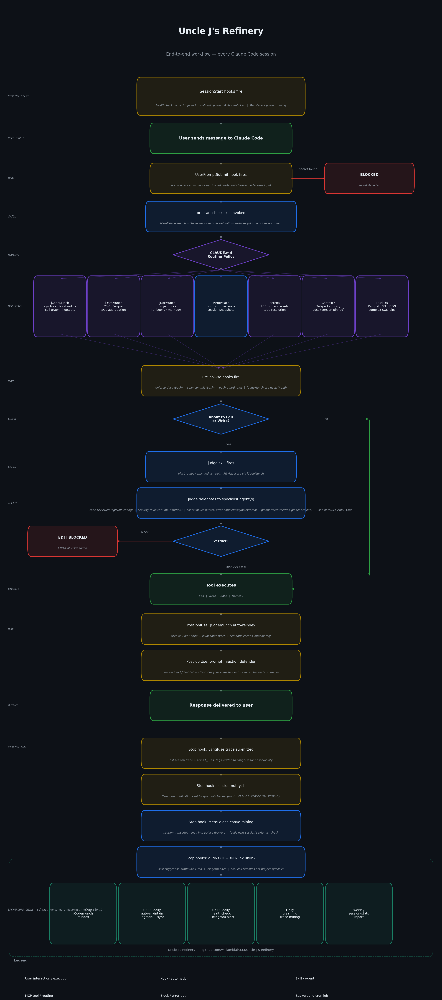

# Uncle J's Refinery

*A self-hosted personal AI operating system for Claude Code — retrieval stack, memory, observability, and a nightly self-improvement loop.*

A complete harness built for a single operator on a single Linux machine:

- **Retrieval stack** — six MCP servers, each routed by modality (source code, tabular data, project docs, semantic memory, SQL, third-party library docs). Claude queries a symbol index instead of reading whole files; a ChromaDB palace with semantic search replaces re-explaining prior decisions each session.
- **Observability** — every Claude turn traced to a self-hosted Langfuse instance: tool calls, timings, token counts, full session replay in a local web UI.
- **Self-improvement loop** — a nightly cron replays Langfuse traces, extracts recurring mistakes and proven playbooks via the `dream-synthesizer` skill, writes them to MemPalace, and patches the model's operating instructions automatically.
- **Autonomous operation** — a Telegram channel handles approval flows and monitoring alerts; daily health check, auto-maintain, and reindex crons keep the stack current without manual intervention.

Install once. The retrieval routing, hooks, and guardrails apply to every Claude Code project on the machine automatically.

**Linux (Debian/Ubuntu).** Built and tested on Debian with apt-based package management.
---

## Contents

- [What you get](#what-you-get)
- [The namesake](#the-namesake)
- [What's in the box](#whats-in-the-box)
- [End-to-end workflow](#end-to-end-workflow)
- [Commercial use — read before you ship](#commercial-use--read-before-you-ship)
- [Prerequisites](#prerequisites)
- [Quick start](#quick-start)
- [Install guide](#install-guide)
  - [1. OS-level prerequisites](#1-os-level-prerequisites)
  - [2. Python stack and MCP server registration](#2-python-stack-and-mcp-server-registration)
  - [3. Verify](#3-verify)
  - [4. Confirm MCP servers](#4-confirm-mcp-servers)
  - [5. Global routing policy](#5-global-routing-policy)
  - [6. Reliability layer](#6-reliability-layer)
  - [7. Guardrails](#7-guardrails)
  - [8. Langfuse observability](#8-langfuse-observability)
  - [9. MCP performance tuning (optional)](#9-mcp-performance-tuning-optional)
  - [10. Stack update alerts (optional)](#10-stack-update-alerts-optional)
  - [11. GitHub webhook server (optional)](#11-github-webhook-server-optional)
  - [12. Bootstrap MemPalace (optional)](#12-bootstrap-mempalace-optional)
  - [13. MemPalace remote backup (recommended)](#13-mempalace-remote-backup-recommended)
  - [14. Telegram gateway (optional)](#14-telegram-gateway--approval-channel-and-monitoring-alerts-optional)
  - [15. Telegram session notifications (optional)](#15-telegram-notify--session-end-notifications-optional)
  - [16. Dreaming (optional)](#16-dreaming--automatic-playbook-extraction-optional)
  - [17. Session stats (optional)](#17-session-stats--weekly-efficiency-reporter-optional)
  - [18. Auto-skill (optional)](#18-auto-skill--automatic-skill-drafting-optional)
  - [19. Skill manager (optional)](#19-skill-manager--global--per-project-skill-symlinks-optional)
  - [20. Ralph cron (optional)](#20-ralph-cron--scheduled-autonomous-ralph-runs-optional)
  - [21. MemPalace automation (optional)](#21-mempalace-automation--keep-the-palace-current-optional)
- [Daily usage](#daily-usage)
- [Troubleshooting](#troubleshooting)
- [File map](#file-map)
- [What lives where after install](#what-lives-where-after-install)
- [Provenance](#provenance)
- [Uninstall](#uninstall)
- [License and credits](#license--credits)

---

## What you get

| Problem | What the Refinery does | Numbers |
|---|---|---|
| Claude reads whole files to find one function | jCodeMunch indexes your repo via Tree-sitter; Claude queries the symbol index instead | ~80% token reduction on real code tasks (up to ~95% on large-file, single-symbol lookups) |
| Massive data files get dumped into context | jDataMunch profiles and slices CSV/TSV; DuckDB handles Parquet/SQL joins | ~25,000× reduction on the LAPD 1M-row benchmark |
| Claude forgets everything between sessions | MemPalace stores decisions, patterns, and prior art in a local ChromaDB palace with semantic search | "What did we decide about auth?" hits sessions from months ago |
| Verbose boilerplate responses | jOutputMunch system-prompt rules strip preamble, summaries, and filler from every reply | 25–40% output token reduction |
| Destructive commands run unchecked | Four guard layers: secret scanner, prompt-injection defender, bash-matcher rules, code-reviewer subagent | `rm -rf`, pipe-to-shell, direct pushes to main — all blocked before they land |
| No observability into what Claude is doing | Langfuse (self-hosted, Docker) traces every turn with tool calls, timings, and token counts | Full session replay in the local UI |

---

## The namesake

This project is named in tribute to **J. Gravelle** ([@jgravelle](https://github.com/jgravelle)), creator of the four tools that do the actual distillation:

- **jCodeMunch** — symbol-level code retrieval (~95% per-read reduction on large files; ~80% across real mixed-use sessions)
- **jDataMunch** — CSV/tabular retrieval (~25,000× reduction on the LAPD 1M-row benchmark)
- **jDocMunch** — section-precise documentation retrieval
- **jOutputMunch** — system-prompt rules that cut output tokens 25–40%

Everything else in this repo — MemPalace, Serena, Context7, DuckDB, Superpowers, Ralph, guardrails, Langfuse, custom skills, install scripts — is plumbing and governance built around that core. Without J. Gravelle's work, there is no refinery to build a plant around. If this stack saves you tokens, the credit belongs to him first.

---

## What's in the box

| Layer | Component | Role |
| --- | --- | --- |
| **Retrieval — code** | jCodeMunch | Tree-sitter symbol index; structural slicing of source code |
| | Serena | LSP-backed code intelligence (Python/TS/Rust/Go/C#) |
| **Retrieval — data** | jDataMunch | CSV/TSV index + profiles/aggregations |
| | DuckDB MCP | SQL over Parquet/JSON/CSV/S3/GCS/R2 |
| **Retrieval — docs** | jDocMunch | Your project docs, section-precise |
| | Context7 | Third-party library docs, version-pinned |
| **Retrieval — memory** | MemPalace | Long-term verbatim memory with semantic search |
| **Efficiency — output** | jOutputMunch | System-prompt rules that cut output tokens 25–40% |
| **Reliability** | Superpowers | 20+ skills: brainstorming, TDD, systematic debugging, verification |
| | Ralph Wiggum | Autonomous loop harness with verification gates |
| | prior-art-check | Custom skill — forces MemPalace lookup before non-trivial work |
| | judge | Custom skill — spawns code-reviewer subagent before Edit/Write |
| **Governance** | jCodeMunch hooks | PreToolUse / PostToolUse / PreCompact / TaskCompleted / SubagentStart enforcement |
| | dwarvesf guardrails | UserPromptSubmit secret scanner + PostToolUse prompt-injection defender |
| | Bash-matcher rules | Block destructive `rm`, pipe-to-shell, direct pushes to main, exfil to webhook services, escalation flags |
| **Observability** | Langfuse | Self-hosted (Docker) — every assistant turn traced with tool calls, timings, token counts |
| **Optional features** | Stack alerts | Daily cron checks GitHub HEAD for each package; Claude assesses relevance; Telegram inline-button pitch; tap ✅ to upgrade |
| | Telegram gateway | Approval + monitoring channel: skill promotion, healthcheck alerts, Ralph plateau, dreaming FYI, post-merge notices |
| | Telegram notify | Stop hook — sends a Telegram notification when each Claude session ends |
| | Dreaming | Daily Langfuse trace mining → mistake patterns + playbooks → MemPalace + CLAUDE.md |
| | Session stats | Weekly Langfuse efficiency reporter; flags high-token sessions; feeds dreaming |
| | Auto-skill | Stop hook — analyzes session transcript; drafts a SKILL.md to `state/skill-drafts/`; pitches via Telegram for approval |
| | Skill manager | Symlinks `global-skills/` + per-project `skills/` into `~/.claude/skills/` at session start |
| | Agent library | 6 specialist subagents in `global-agents/` — planner, code-reviewer, security-reviewer, architect, tdd-guide, silent-failure-hunter — symlinked to `~/.claude/agents/` |
| | Ralph cron | Installs per-PRD cron jobs that run the verification-gated Ralph harness on a schedule |
| | MemPalace automation | Stop hook (convo mining) + daily cron (project mining) — keeps palace current automatically |

All 7 MCP servers register at **user scope**, so they're live in every Claude Code project on this machine automatically.

---

## End-to-end workflow

Every message through Claude Code passes through the full pipeline below — hooks, routing, MCP tools, judge + specialist agents, and session-end automation. Click to open full size.

<p align="center">
  
</p>

See [`docs/RELIABILITY.md`](docs/RELIABILITY.md) for the agent trigger matrix and a text version of this flow.

---

## Commercial use — read before you ship

The glue in this repo (install scripts, skills, harness) is **AGPL-3.0**: free to use, modify, and self-host, but if you deploy a modified version as a network service you must publish your modifications under the same license. Four additional pieces have their own terms — read before you ship.

**1. Uncle J's tools (jCodeMunch, jDataMunch, jDocMunch, jOutputMunch)**

Free for personal use. Commercial use requires a license from J. Gravelle directly.

- [Free for personal use](https://github.com/jgravelle/jcodemunch-mcp#free-for-personal-use)
- [Commercial licenses](https://github.com/jgravelle/jcodemunch-mcp#commercial-licenses)

**2. Claude Code + Ralph Wiggum plugin (Anthropic)**

Claude Code is not open-source. Its `LICENSE.md` reads: "© Anthropic PBC. All rights reserved. Use is subject to Anthropic's Commercial Terms of Service." The Ralph Wiggum plugin ships from the same repo and inherits those terms.

Commercial use is governed by [Anthropic's Commercial Terms of Service](https://www.anthropic.com/legal/commercial-terms). Redistribution and modification are not granted by default.

**3. Langfuse (self-hosted)**

Everything outside the `/ee` folder is MIT — free for commercial use with no usage limits. The `/ee` folder contains enterprise-only features (SCIM, audit logs, data retention policies) that require a commercial license. See [Langfuse open-source FAQ](https://langfuse.com/docs/open-source).

**Everything else** — MemPalace, Serena, DuckDB MCP, Context7, Superpowers, dwarvesf/claude-guardrails, and the Langfuse template — is MIT-licensed. No commercial restrictions beyond attribution.

**This repo's glue code** — install scripts, merged CLAUDE.md, custom skills, Ralph harness, and all supporting scripts — is **AGPL-3.0** (see `LICENSE`). Free for personal and commercial use; network-deployed modifications must be released under the same license.

---

## Prerequisites

- **Bash 4+**
- **Python 3.11+** — auto-installed via `uv` if missing
- **Node.js 18+** — for Context7
- **Git 2.30+**
- **Docker + Docker Compose plugin** — for Langfuse (optional, but recommended)
- **~15 GB free disk** — Langfuse images are ~5 GB; Postgres/ClickHouse/MinIO grow as they run
- **Internet connection** — first run pulls ~2 GB of Python/Node/Docker packages

The installers detect missing prerequisites and either auto-install them (where safe — e.g., `uv`) or tell you what to `apt` and exit cleanly.

---

## Quick start

If you're on a fresh machine and want the core stack with observability:

```bash
git clone https://github.com/williamblair333/Uncle-J-s-Refinery.git
cd Uncle-J-s-Refinery

./prerequisites.sh          # git, node, claude via your distro's package manager
./install.sh --auto-register
./verify.sh                 # expect all PASS
cp CLAUDE.md.merged ~/.claude/CLAUDE.md
./install-reliability.sh
./install-guardrails.sh
./install-langfuse.sh
```

Then open a Claude Code session in any project. The routing policy and hooks apply automatically.

---

## Install guide

All commands run from the repo root.

### 1. OS-level prerequisites

Installs git, Node.js LTS, and the Claude Code CLI via your OS package manager. Skips anything already present.

```bash
./prerequisites.sh
```

Supported: **Debian/Ubuntu** (`apt-get`). Other distros require manual prerequisite installation.

### 2. Python stack and MCP server registration

```bash
./install.sh --auto-register
```

This script does the following, in order:

1. Installs `uv` (fast Python package manager) if missing.
2. Creates `.venv/` via `uv venv --python 3.11`.
3. `uv sync` — installs jcodemunch-mcp, jdatamunch-mcp, jdocmunch-mcp, mempalace from their GitHub repos (pinned to exact commit SHAs in `uv.lock`).
4. Warm-caches Serena and DuckDB MCP via uvx.
5. Runs `jcodemunch-mcp init --yes --hooks --audit` — installs enforcement hooks into `~/.claude/settings.json` and appends the retrieval routing policy to `~/.claude/CLAUDE.md`.
6. With `--auto-register`: runs `claude mcp add -s user ...` for all 7 MCP servers.
7. Sets `MCP_TIMEOUT=60000` in Claude Code's env block (default 30s is too short for Serena and MotherDuck cold-starts).
8. Registers cron jobs for scheduled maintenance tasks.

### 3. Verify

```bash
./verify.sh
```

Expect **all PASS**. See [Troubleshooting](#troubleshooting) if anything fails — the most common culprit is `~/.local/bin` not being on `$PATH`.

### 4. Confirm MCP servers

```bash
claude mcp list
```

All seven should show `✓ Connected`. The three Google remotes (Drive/Gmail/Calendar) show `! Needs authentication` until you OAuth them via `/mcp` inside Claude Code — that's expected.

### 5. Global routing policy

```bash
cp CLAUDE.md.merged ~/.claude/CLAUDE.md
```

This file is Claude's operating instructions — it tells the model which retrieval tool to reach for first (symbol index before raw file reads; semantic memory before web search), and includes the jOutputMunch output-discipline rules that eliminate preamble and filler from responses.

**Why this matters:** Without the routing policy, Claude defaults to reading files directly (expensive). With it, Claude queries the structural index first and only falls back to raw reads when necessary.

### 6. Reliability layer

```bash
./install-reliability.sh
```

Installs two custom skills:

- `~/.claude/skills/prior-art-check/SKILL.md` — forces a MemPalace lookup at the start of every non-trivial task ("have we solved this before?")
- `~/.claude/skills/judge/SKILL.md` — spawns a code-reviewer subagent with structural evidence before any Edit or Write lands

Then, inside a Claude Code session, install the two Anthropic marketplace plugins:

```
/plugin marketplace add anthropics/claude-code
/plugin install superpowers@claude-plugins-official
/plugin install ralph-wiggum@anthropics-claude-code
/reload-plugins
```

**Superpowers** adds 20+ battle-tested skills: brainstorming with design gates, TDD enforcement, systematic debugging, requesting-code-review, and verification-before-completion. **Ralph Wiggum** adds `/ralph-loop` for autonomous agent loops with configurable exit criteria.

### 7. Guardrails

```bash
./install-guardrails.sh
```

Installs `jq` if missing, then delegates to dwarvesf's `install.sh`, which does a proper deep-merge of `~/.claude/settings.json` — the jCodeMunch hooks already in place stay intact.

This adds two new hooks:
- `UserPromptSubmit` → `scan-secrets.sh` — blocks pasted credentials before they reach Claude
- `PostToolUse` (Read/WebFetch/Bash/mcp__.*) → `prompt-injection-defender.sh` — detects and blocks prompt-injection attempts in tool results

Plus five `PreToolUse` bash-matcher rules that block:
- Destructive `rm` commands
- Pipe-to-shell patterns (`curl ... | sh`)
- Direct pushes to main/master
- Exfiltration to webhook.site or ngrok
- Privilege escalation flags (`--dangerously-skip-permissions` outside approved contexts)

### 8. Langfuse observability

```bash
./install-langfuse.sh
```

Langfuse is a self-hosted observability platform for LLM applications. Every Claude turn gets traced with tool calls, timings, token counts, and the full prompt/response — accessible via a local web UI.

**If Docker isn't installed (Linux):**

```bash
curl -fsSL https://get.docker.com | sh
sudo usermod -aG docker "$USER"
# Log out and back in (or: newgrp docker) so group membership takes effect
```

The installer then:

1. Clones `doneyli/claude-code-langfuse-template` and configures it for this machine (including a workaround for a ClickHouse crash on Linux 6.18 Liquorix — see [Troubleshooting](#langfuse-clickhouse-crashes-with-stdfstof-no-conversion)).
2. Generates `.env` with random secure credentials.
3. Runs `docker compose up -d` with a 3-attempt retry loop (first pull is ~5 GB; boot takes 90–120s).
4. Installs the Langfuse Stop hook into `~/.claude/hooks/`.
5. Installs `langfuse>=3.0,<4` into the stack venv (avoids the PEP 668 conflict on Debian 13).
6. Patches `~/.claude/settings.json` with the Stop hook and the `LANGFUSE_*` env block.

**Langfuse UI:** http://localhost:3050
Login: `admin@localhost.local` / the password in `claude-code-langfuse-template/.env` (`LANGFUSE_INIT_USER_PASSWORD`).

### 9. MCP performance tuning (optional)

`install.sh` already sets `MCP_TIMEOUT=60000` so Claude Code allows 60 seconds for MCP cold-starts (the default 30s isn't enough for Serena and MotherDuck on first launch).

For faster repeated cold-starts (14–24s → 7–18s), install Serena, MotherDuck, and Context7 as real binaries instead of running them via `uvx`/`npx` on each launch:

```bash
uv tool install --from git+https://github.com/oraios/serena serena-agent
uv tool install mcp-server-motherduck

# If npm's global prefix requires root (i.e. `npm prefix -g` returns /usr/local),
# configure a user-local prefix first:
[ "$(npm prefix -g)" = "/usr/local" ] && npm config set prefix ~/.npm-global
npm install -g @upstash/context7-mcp

claude mcp remove serena
claude mcp add -s user serena -- "$HOME/.local/bin/serena" start-mcp-server --context ide-assistant

claude mcp remove duckdb
claude mcp add -s user duckdb -- "$HOME/.local/bin/mcp-server-motherduck" --db-path :memory: --read-write --allow-switch-databases

claude mcp remove context7
claude mcp add -s user context7 -- "$(npm prefix -g)/bin/context7-mcp"

claude mcp list
```

### 10. Stack update alerts (optional)

A daily cron job that checks whether each of the four core Python packages is behind GitHub HEAD, invokes Claude to assess whether the update is worth taking, and sends you a Telegram inline-button pitch. Tap ✅ and Claude upgrades the package; tap ❌ and it's silently dropped.

```bash
bash features/stack-alerts/install.sh
```

Requires a Telegram bot token and your chat ID (see `features/stack-alerts/README.md`).

**Git is the golden reference.** The four core Python packages are installed from their GitHub repos via `uv`, not PyPI. The lockfile (`uv.lock`) pins exact commit SHAs. The freshness check compares the locked SHA against `HEAD` on each repo — a PyPI release is not required for an update to be available.

Run the freshness check manually at any time:

```bash
bash scripts/check-stack-freshness.sh
```

| Tier | Tools | Action threshold |
|---|---|---|
| **git packages** | jcodemunch, jdatamunch, jdocmunch, mempalace | Behind HEAD → upgrade |
| **Langfuse** | langfuse, langfuse-worker | New version available → pull |
| **Langfuse infrastructure** | ClickHouse, Redis, Postgres | New major exists — informational only; update only if Langfuse release notes require it |

MinIO uses a Chainguard image that auto-patches CVEs — no action needed.

To upgrade Python packages to latest HEAD:

```bash
cd "$STACK_ROOT"
uv lock --upgrade-package jcodemunch-mcp --upgrade-package jdatamunch-mcp \
  --upgrade-package jdocmunch-mcp --upgrade-package mempalace && uv sync --inexact
```

**Post-merge hook.** `install.sh` wires a `git post-merge` hook that fires on every `git pull`. It detects new features, changed `install.sh`, updated `CLAUDE.md`, and new skills, then sends a Telegram alert (or prints to terminal) listing what needs action.

### 11. GitHub webhook server (optional)

Receives GitHub events and acts on them without polling.

| Event | Action |
|---|---|
| `push` | Runs `verify.sh`, sends health check result to Telegram |
| `pull_request` opened/updated | Fetches the diff, Claude auto-reviews, posts a GitHub comment |

Requires a public URL pointing at this machine — [ngrok](https://ngrok.com), [Tailscale Funnel](https://tailscale.com/kb/1223/funnel), or a VPS.

```bash
bash features/github-webhook/install.sh
```

The installer checks dependencies, prompts for your public URL, generates a webhook secret, installs a systemd user service, and registers the webhook on GitHub.

Full setup guide: [`features/github-webhook/README.md`](features/github-webhook/README.md)

### 12. Bootstrap MemPalace (optional)

MemPalace is installed but empty after a fresh install. To seed it:

```bash
./.venv/bin/mempalace init ~/path/to/a/project
./.venv/bin/mempalace mine ~/path/to/a/project
./.venv/bin/mempalace mine ~/.claude/projects/ --mode convos
```

The last line ingests all your existing Claude Code session transcripts so "what did we decide about X" returns hits from day one.

### 13. MemPalace remote backup (recommended)

Your palace lives at `~/.mempalace/palace` — outside the repo, outside any container. If you wipe the machine or switch computers, it's gone unless you have a remote copy. Everything Claude has learned across all sessions — decisions, patterns, prior art, playbooks — lives there. It's worth protecting.

#### One-time setup

```bash
sudo apt install rclone   # or: curl https://rclone.org/install.sh | sudo bash

rclone config   # follow the interactive prompts — supports S3, GCS, Dropbox, Backblaze B2, SFTP, and more
```

Set `MEMPALACE_REMOTE` in Claude Code's env so the backup cron picks it up:

```bash
python3 - <<'PY'
import json, pathlib
p = pathlib.Path.home() / ".claude/settings.json"
d = json.loads(p.read_text()) if p.exists() else {}
d.setdefault("env", {})["MEMPALACE_REMOTE"] = "myremote:my-bucket/mempalace"
p.write_text(json.dumps(d, indent=2))
print("written")
PY
```

Replace `myremote:my-bucket/mempalace` with your actual rclone remote and path. After this, the existing 6-hour backup cron (`mempalace-backup.sh`) syncs the palace to your remote automatically.

#### Restoring on a new machine

After running the full installer, pull your palace before starting Claude Code:

```bash
rclone copy myremote:my-bucket/mempalace ~/.mempalace/palace
```

#### Working across two machines simultaneously

ChromaDB does not support concurrent writers. **Do not point two active Claude Code instances at the same remote palace simultaneously** — you will corrupt it.

Safe pattern: one machine active at a time. When switching:

1. On machine A: wait for the next backup cron, or run `bash mempalace-backup.sh` manually.
2. On machine B: `rclone copy myremote:my-bucket/mempalace ~/.mempalace/palace` before starting Claude Code.

#### Merging two diverged palaces

If two machines both accumulated sessions independently (no shared remote), merging is not automatic. Best path:

```bash
# On the receiving machine, re-mine both sets of session traces:
./.venv/bin/mempalace mine ~/.claude/projects/ --mode convos
# Copy the other machine's session traces over (~/.claude/projects/) and mine again.
```

Manually-written drawers (not derived from sessions) must be migrated via `mempalace export` / `mempalace import` if available in your version, or by copying drawer files from the palace SQLite directly.

### 14. Telegram gateway — approval channel and monitoring alerts (optional)

A cron job that polls your Telegram bot every 2 minutes. **Primary purpose: approval and monitoring**, not general-purpose chat. The bot does not maintain conversational context across sessions.

**Inbound commands:**
- `promote <id> global` / `promote <id> project` — install a skill draft from `state/skill-drafts/`
- `promote <id>` — ask Claude to classify scope first, then confirm

**Outbound notification events (sent automatically):**
- Daily healthcheck failure at 07:00 (from `healthcheck-notify.sh`)
- New skill draft available after a session (from the auto-skill Stop hook)
- Stack upgrade pitch after `auto-maintain.sh` detects packages behind HEAD
- Ralph iteration plateau reached (max iterations without a done verdict)
- Dream synthesis run completed
- Unauthorized `chat_id` access attempt or injection attempt blocked
- `git pull` post-merge summary (new features, install steps, skills needing action)

Requires stack-alerts (step 10) first — reuses the same bot token and chat ID.

```bash
bash features/telegram-gateway/install.sh
# uninstall: bash features/telegram-gateway/install.sh --uninstall
```

**Security:** rate limits, injection-pattern blocking, dangerous Unicode stripping, output path/secret redaction, and an anti-disclosure system prompt so the bot never leaks OS, kernel, paths, git details, MCP stack, or credentials. Implemented in `scripts/lib/tg_security.py`.

Logs: `state/telegram-gateway.log`

### 15. Telegram notify — session-end notifications (optional)

A Stop hook that sends you a Telegram message when each Claude Code session ends, with a one-line summary of what Claude did.

```bash
bash features/telegram-notify/install.sh
# uninstall: bash features/telegram-notify/install.sh --uninstall
```

Requires `TELEGRAM_BOT_TOKEN` and `TELEGRAM_CHAT_ID` in `.env` (set by step 10).

### 16. Dreaming — automatic playbook extraction (optional)

Queries Langfuse for traces from the past day, synthesizes recurring mistakes and proven playbooks via the `dream-synthesizer` skill, writes dated output to `~/.claude/dreaming-output/`, ingests it into MemPalace (wing: `dreaming`), and appends proven playbooks to `~/.claude/CLAUDE.md` idempotently.

```bash
bash features/dreaming/install.sh
# manual trigger any time:
bash features/dreaming/dream.sh
# or from inside Claude Code: /dream
```

Runs daily at 2 AM by default (`DREAMING_CRON_SCHEDULE` in `state/dreaming.env`). See `features/dreaming/README.md` for configuration.

### 17. Session stats — weekly efficiency reporter (optional)

Queries Langfuse for the past 7 days of sessions, renders a markdown table (date, project, traces, tool calls, tokens), flags sessions exceeding 40k tokens, and writes output that Dreaming picks up on its next run.

```bash
bash features/session-stats/install.sh
# manual trigger: bash features/session-stats/stats.sh
# or from inside Claude Code: /stats
```

Runs every Sunday at 8 AM by default. See `features/session-stats/README.md`.

### 18. Auto-skill — automatic skill drafting (optional)

A Stop hook that reads the full session transcript, asks Claude whether the session demonstrated a reusable workflow, and — if yes — drafts a `SKILL.md` to `state/skill-drafts/<id>-skill-draft.md`. A Telegram notification is sent with a 300-character preview and the promotion command:

```
promote <id> global
```

The draft is not installed until you send that command via Telegram. Review the preview, then promote or ignore.

```bash
bash features/auto-skill/install.sh
# uninstall: bash features/auto-skill/install.sh --uninstall
```

### 19. Skill manager — global + per-project skill symlinks (optional)

Symlinks every skill in `global-skills/` into `~/.claude/skills/` once at install time, and installs SessionStart/Stop hooks that symlink/remove the per-project `skills/` directory so project-specific skills are available only while you're in that project.

```bash
bash features/skill-manager/install.sh
# uninstall: bash features/skill-manager/install.sh --uninstall
```

### 20. Ralph cron — scheduled autonomous Ralph runs (optional)

Installs a cron job that runs the verification-gated Ralph harness against a given PRD file on a schedule you choose interactively.

```bash
bash features/ralph-cron/install.sh
bash features/ralph-cron/install.sh --list       # show installed ralph crons
bash features/ralph-cron/install.sh --uninstall MARKER
```

### 21. MemPalace automation — keep the palace current (optional)

Installs:
- **Stop hook**: mines `~/.claude/projects/` after every session (conversation mode)
- **Daily 3 AM cron**: mines the project repo (code mode)
- **Nightly 4 AM cron**: runs `mempalace repair` to rebuild HNSW index from SQLite (prevents drift)

Without this, you must run `mempalace mine` manually; HNSW index can drift and degrade semantic search.

```bash
bash features/mempalace/install.sh
# uninstall: bash features/mempalace/install.sh --uninstall
```

---

## Daily usage

Just use Claude Code normally. The stack is global — every project, every session, the routing policy and hooks apply automatically.

**Signs it's working:**
- Claude reaches for `search_symbols` / `get_file_outline` instead of `Read` on a source file
- Responses don't start with "Great question!" or end with "I hope this helps!"
- Traces appear in Langfuse within seconds of each turn
- Destructive commands get blocked before they run

### Per-project customization

Add a `CLAUDE.md` to any repo root to override or extend the global policy for that project. Add a `.claude/settings.local.json` for per-project MCP servers, hooks, or permissions.

### Skipping permission prompts for a folder

```bash
mkdir -p .claude
cat > .claude/settings.local.json <<'EOF'
{
  "permissions": {
    "defaultMode": "acceptEdits",
    "allow": ["Bash(*)", "Edit(*)", "Write(*)"]
  }
}
EOF
```

Never do this globally or in a folder containing credentials.

### Using Ralph (autonomous loop)

```bash
./ralph-harness.sh --prd ./PRD.md --repo /path/to/repo
```

Our harness uses the retrieval stack's verification tools (`get_pr_risk_profile < 0.65`, `get_untested_symbols == 0`, PRD marked DONE) as exit criteria — solves Ralph's classic failure mode of declaring victory on a broken change. Starting template at `prd-template.md`.

### Runtime health check

`verify.sh` confirms binaries exist. `healthcheck.sh` confirms the stack is actually wired up and responding — use it to catch silent regressions that install-time checks miss (MCP server registered at wrong scope, Langfuse container died overnight, etc.).

```bash
./healthcheck.sh            # --quick (default, ~6s)
./healthcheck.sh --full     # + nested claude -p smoke + Langfuse trace API (~60s)
```

The script is **read-only** — failures include the remediation command in the `fix:` line; they do not auto-heal. Final stdout line is machine-parseable: `HEALTHCHECK: ok` or `HEALTHCHECK: fail (<n>) -- <first failing check>`.

Automated invocation:
- **SessionStart hook** — `healthcheck.sh --quick` runs at the start of every Claude Code session. Banner prints as a system-reminder at session open; no-ops silently when you open a session outside this repo.
- **`/health` slash command** — runs `healthcheck.sh --full` on demand mid-session.

---

## Troubleshooting

### `HEALTHCHECK: fail` in the session banner

The banner's `fix:` line tells you what to run. Common causes:

| Banner says | Fix |
|---|---|
| `mcp-servers-down(jcodemunch)` etc | `./install.sh --auto-register` |
| `jcodemunch-wrong-scope` | `claude mcp remove jcodemunch -s local ; claude mcp remove jcodemunch -s project` |
| `mcp-timeout` | Re-run `./install.sh` — rewrites `MCP_TIMEOUT=60000` |
| `docker-down` / `langfuse-unhealthy` | `docker compose -f claude-code-langfuse-template/docker-compose.yml up -d` |
| `langfuse-sdk-missing` | Re-run `./install-langfuse.sh` |
| `mempalace-sqlite` | `sqlite3 ~/.mempalace/palace/chroma.sqlite3 "INSERT INTO embedding_fulltext_search(embedding_fulltext_search) VALUES('rebuild');"` |
| `mempalace-stale-lock` | `rmdir state/mempalace-mine-convos.lock state/mempalace-mine-project.lock 2>/dev/null` — locks auto-clear after 30 min |
| `mempalace-hnsw-corruption` | Run `/mempalace-hnsw-corruption-fix` skill |
| `cron-missing(...)` | Re-run `./install.sh` — crons are registered in step 6d |
| `stack-not-at-head` | `uv lock --upgrade-package jcodemunch-mcp --upgrade-package jdatamunch-mcp --upgrade-package jdocmunch-mcp --upgrade-package mempalace && uv sync --inexact` |
| `post-merge-hook-missing` | `ln -sfn "$STACK_ROOT/scripts/post-merge-hook.sh" "$STACK_ROOT/.git/hooks/post-merge"` |
| `secrets` | Review the grep hits; add to `.gitignore` or redact |
| `hook-no-fire` / `trace-api` (full mode) | `tail -5 ~/.claude/state/langfuse_hook.log`, then verify `from langfuse import Langfuse` works from the stack venv |

### `verify.sh` reports FAIL after fresh install

Check `echo $PATH` — `~/.local/bin` must be on it (where `uv` and the installed MCP binaries live). Add to your shell RC if not:

```bash
export PATH="$HOME/.local/bin:$PATH"
```

### MCP servers show ✗ Failed to connect

Check whether the timeout is actually set:

```bash
python3 -c "import json; d=json.loads(open(f\"{__import__('os').path.expanduser('~')}/.claude/settings.json\").read()); print(d.get('env',{}).get('MCP_TIMEOUT','<unset>'))"
# expect: 60000
```

If it's `<unset>` or below 60000, re-run `install.sh --auto-register`. If it's set and servers still fail, follow step 9 to install them as real binaries.

### jcodemunch registered as `uvx jcodemunch-mcp` instead of the venv path

`jcodemunch-mcp init` self-registers via `uvx` during step 2. `install.sh` removes and re-adds with the venv path, so re-runs converge. If you see this on an older install:

```bash
claude mcp remove jcodemunch
claude mcp add -s user jcodemunch "$STACK_ROOT/.venv/bin/jcodemunch-mcp"
# or just re-run:
./install.sh --auto-register
```

### Langfuse ClickHouse crashes with `std::stof: no conversion`

Seen on Linux 6.18 Liquorix; may affect other kernels where the container's `/sys/fs/cgroup/cpu.max` is a 0-byte file. `install-langfuse.sh` injects a bind-mount of a `max 100000` file over that path. If you see the crash on a host where the installer didn't apply the workaround, add to the ClickHouse service's volumes:

```yaml
- ./clickhouse/cpu.max.override:/sys/fs/cgroup/cpu.max:ro
```

with `./clickhouse/cpu.max.override` containing the line `max 100000`.

### Langfuse UI is up but traces don't appear

```bash
tail -30 ~/.claude/state/langfuse_hook.log
```

Common failures:
- `'Langfuse' object has no attribute 'start_as_current_span'` → langfuse SDK is v4+. Downgrade: `python3 -m pip install "langfuse>=3.0,<4"`
- `Langfuse API keys not set` → env block missing. Re-run `./install-langfuse.sh`.
- Empty log, hook dir missing → `mkdir -p ~/.claude/state`

### Langfuse containers fail to start (`dependency failed to start`)

Usually disk pressure:

```bash
df -h /
docker system df
```

If less than 10 GB free: free space, or point Docker's data-root at a different mount (`/etc/docker/daemon.json`, key `data-root`). Then:

```bash
cd claude-code-langfuse-template
docker compose down -v
docker compose up -d
```

The `-v` drops half-initialized volumes so they recreate cleanly.

### Claude Code keeps asking for permissions

Per-folder: see "Skipping permission prompts" above.

Per-session escape hatch: `claude --dangerously-skip-permissions`.

Inside a running session: `/permissions` opens the interactive editor.

### jOutputMunch rules aren't taking effect

```bash
grep -c jOutputMunch ~/.claude/CLAUDE.md
# expect 1 or more; if 0, re-run step 5
cp CLAUDE.md.merged ~/.claude/CLAUDE.md
```

### Nuclear reset

```bash
# Back up first
cp -r ~/.claude ~/.claude.bak.$(date +%Y%m%d-%H%M%S)

# Stop Langfuse
(cd claude-code-langfuse-template && docker compose down -v)

# Remove MCP registrations
for s in jcodemunch jdatamunch jdocmunch mempalace serena duckdb context7; do
    claude mcp remove "$s" 2>/dev/null
done

# Remove venv
rm -rf .venv .venv-test
```

Re-run from step 2.

---

## File map

```
Uncle-J-s-Refinery/
├── README.md                           ← this file
├── CLAUDE.md                           ← base routing policy
├── CLAUDE.md.merged                    ← full policy: routing + security + jOutputMunch (cp to ~/.claude/)
├── AGENTS.md                           ← agent-facing policy mirror
├── CHANGELOG.md                        ← version history
├── HANDOFF.md                          ← overnight-handoff brief + work log
├── ROADMAP.md                          ← living roadmap (In Progress / Planned / Completed)
├── CONTRIBUTING.md                     ← contribution guide, commit format, session-end requirement
├── SECURITY.md                         ← vulnerability reporting policy (private disclosure)
├── .session-end.yml                    ← per-project session-end checklist config
├── PORTING.md                          ← notes for porting to a new machine
├── PRD.md                              ← Ralph-driven maintenance PRD
├── prd-template.md                     ← starting template for Ralph tasks
├── pyproject.toml                      ← uv-managed Python deps
├── uv.lock
├── mempalace.yaml                      ← MemPalace wing/room configuration
├── mempalace-backup.sh                 ← rclone sync of ~/.mempalace/palace to remote
├── mempalace-health.py                 ← SQLite health probe used by healthcheck.sh
├── patch-jcodemunch-hook-paths.py      ← one-time fix for hook path mismatches after move
├── LICENSE                             ← AGPL-3.0; upstream licenses apply to each dep
├── .venv/                              ← real Python venv created by install.sh (gitignored)
│
├── prerequisites.sh                    ← step 1: git/node/claude
├── install.sh                          ← step 2: Python stack + MCP registration
├── finish-install.sh                   ← re-attempt after shell refresh
├── verify.sh                           ← step 3: all-pass sanity check
├── healthcheck.sh                      ← runtime health check (--quick / --full)
├── install-reliability.sh              ← step 6: custom skills + guardrails clone
├── install-guardrails.sh               ← step 7: dwarvesf guardrails via upstream install.sh
├── install-langfuse.sh                 ← step 8: Docker + Langfuse + Stop hook
├── ralph-harness.sh                    ← verification-gated Ralph loop
│
├── scripts/
│   ├── auto-maintain.sh                ← scheduled self-maintenance runner
│   ├── check-stack-freshness.sh        ← checks installed vs latest for all MCP tools
│   ├── github-webhook-server.py        ← HTTP server for GitHub push/PR events
│   ├── healthcheck-notify.sh           ← daily Telegram notification on healthcheck failure
│   ├── jcodemunch-reindex.sh           ← triggers jcodemunch re-index after significant changes
│   ├── mempalace-mcp-start.sh          ← wrapper that starts the mempalace MCP server
│   ├── mempalace-mine-convos.sh        ← mines ~/.claude/projects/ (conversation mode)
│   ├── mempalace-mine-project.sh       ← mines the project repo (code mode)
│   ├── post-merge-hook.sh              ← git post-merge hook; alerts on new features
│   ├── ralph-cron-run.sh               ← runs ralph-harness.sh for a given PRD (cron target)
│   ├── review-check.sh                 ← runs the code review checklist
│   ├── session-end-check.sh            ← pre-commit hook (blocks) + Stop hook (Telegram warn)
│   ├── session-notify.sh               ← sends Telegram notification on session end
│   ├── skill-link.sh                   ← symlinks a skill into ~/.claude/skills/
│   ├── skill-suggest.sh                ← analyzes session tool use and suggests skills
│   ├── stack-alerts-poll.sh            ← polls Telegram for replies to upgrade pitches
│   ├── stack-alerts-send.sh            ← sends upgrade pitch to Telegram
│   ├── telegram-gateway-poll.sh        ← polls Telegram for user messages; routes to claude -p
│   └── lib/
│       ├── __init__.py
│       └── tg_security.py              ← input sanitizer, output scanner, path validator, rate limiter
│
├── lib/
│   ├── feature-helpers.sh              ← shared installer utilities (prompt, write_env_var, cron)
│   ├── notify.sh                       ← notification dispatcher (reads NOTIFY_CHANNEL)
│   └── notify-telegram.sh              ← Telegram backend (send pitch, poll reply, send text)
│
├── features/
│   ├── auto-skill/
│   │   └── install.sh                  ← Stop hook: suggests skills based on session tool use
│   ├── dreaming/
│   │   ├── install.sh                  ← daily Langfuse trace mining → MemPalace + CLAUDE.md
│   │   ├── dream.sh                    ← manual trigger
│   │   ├── dream.md                    ← /dream slash command
│   │   ├── README.md                   ← full feature docs
│   │   └── skills/                     ← dream-synthesizer skill (installed to ~/.claude/skills/)
│   ├── github-webhook/
│   │   ├── install.sh                  ← systemd user service + GitHub webhook registration
│   │   └── README.md                   ← setup guide, public URL requirements
│   ├── mempalace/
│   │   └── install.sh                  ← Stop hook (convos) + daily cron (project) mining
│   ├── ralph-cron/
│   │   └── install.sh                  ← per-PRD cron jobs for scheduled Ralph runs
│   ├── session-stats/
│   │   ├── install.sh                  ← weekly Langfuse reporter + /stats command
│   │   ├── stats.sh                    ← manual trigger
│   │   ├── stats.md                    ← /stats slash command
│   │   └── README.md                   ← full feature docs
│   ├── skill-manager/
│   │   └── install.sh                  ← symlinks global-skills/ + project skills/ at session start
│   ├── stack-alerts/
│   │   ├── install.sh                  ← interactive setup: Telegram creds + cron
│   │   └── README.md                   ← feature docs, prerequisites, uninstall
│   ├── telegram-gateway/
│   │   └── install.sh                  ← cron poll: Telegram → claude -p → Telegram reply
│   └── telegram-notify/
│       └── install.sh                  ← Stop hook: Telegram notification on session end
│
├── global-agents/                      ← specialist subagents, symlinked to ~/.claude/agents/
│   ├── architect.md
│   ├── code-reviewer.md
│   ├── planner.md
│   ├── security-reviewer.md
│   ├── silent-failure-hunter.md
│   └── tdd-guide.md
│
├── global-skills/                      ← project-agnostic skills, symlinked to ~/.claude/skills/
│   ├── deep-repo-analysis/
│   ├── judge/
│   ├── mempalace-hnsw-corruption-fix/
│   ├── orchestrator/
│   ├── outcomes/
│   ├── per-task-review-cycle/
│   ├── polling-bot-age-filter-fix/
│   ├── polling-bot-backlog-diagnosis/
│   ├── post-upgrade-mcp-integration/
│   ├── prior-art-check/
│   ├── session-end-checklist/          ← AI-invoked checklist walker (mandatory → consider → custom)
│   ├── stack-not-at-head-remediation/
│   ├── stale-lock-diagnosis/
│   ├── stale-pending-memory-guard/
│   ├── telegram-gateway-security-audit/
│   ├── telegram-inline-button-promote/
│   └── verify-handoff-claims/
│
├── skills/                             ← per-project skills (symlinked only in this repo's sessions)
│
├── tests/
│   ├── __init__.py
│   ├── test_session_end_check.py       ← pytest suite for scripts/session-end-check.sh (10 tests)
│   └── test_tg_security.py             ← pytest suite for scripts/lib/tg_security.py
│
├── state/                              ← runtime state (gitignored except .gitkeep)
│   ├── stack-alerts-pending.json
│   ├── telegram-gateway-offset.txt     ← Telegram update_id watermark (dedup)
│   ├── telegram-gateway.log
│   ├── telegram-gateway-ratelimit.json
│   ├── dreaming.env                    ← dreaming feature config (gitignored)
│   ├── dreaming.log
│   ├── session-stats.env               ← session-stats config (gitignored)
│   └── skill-drafts/                   ← auto-skill draft suggestions
│
├── docs/
│   ├── STACK.md                        ← one-page-per-tool reference
│   ├── RELIABILITY.md                  ← reliability-layer deep dive
│   └── SESSION-END.md                  ← session-end checklist standard (three-layer model)
│
└── mcp-clients/
    ├── claude-code-mcp.json.tmpl       ← templates rendered at install time
    ├── claude-desktop-config-fragment.json.tmpl
    ├── cursor-mcp.json.tmpl
    └── windsurf-mcp.json.tmpl
```

Cloned at install time (gitignored):

```
├── claude-guardrails/                  ← dwarvesf/claude-guardrails
└── claude-code-langfuse-template/      ← doneyli/claude-code-langfuse-template
```

---

## What lives where after install

```
~/.claude/
├── CLAUDE.md                           ← routing + security + jOutputMunch (from step 5)
├── settings.json                       ← hooks, env vars, permissions.deny
├── .claude.json                        ← MCP server registrations (managed by `claude mcp add`)
├── skills/
│   ├── prior-art-check/                ← from step 6 (or skill-manager)
│   ├── judge/                          ← from step 6 (or skill-manager)
│   ├── dream-synthesizer/              ← from features/dreaming
│   └── <others>/                       ← symlinked from global-skills/ by skill-manager
├── commands/
│   ├── dream.md                        ← /dream slash command
│   ├── stats.md                        ← /stats slash command
│   ├── health.md                       ← /health slash command
│   └── ...
├── hooks/
│   ├── langfuse_hook.py                ← Stop hook (step 8)
│   ├── scan-secrets/                   ← guardrail (step 7)
│   ├── scan-commit/                    ← guardrail (step 7)
│   └── prompt-injection-defender/      ← guardrail (step 7)
├── dreaming-output/                    ← dated dream + stats reports (feeds MemPalace)
│   ├── dream-YYYY-MM-DD.md
│   └── stats-YYYY-MM-DD.md
├── state/
│   ├── langfuse_hook.log
│   ├── langfuse_state.json
│   └── pending_traces.jsonl
├── projects/                           ← Claude Code session transcripts
└── logs/
    └── permission-events.jsonl
```

---

## Provenance

| Tool | Origin |
| --- | --- |
| jCodeMunch / jDataMunch / jDocMunch / jOutputMunch | [@jgravelle](https://github.com/jgravelle) |
| MemPalace | [mempalaceofficial.com](https://mempalaceofficial.com) |
| Serena | [oraios/serena](https://github.com/oraios/serena) |
| DuckDB MCP | [motherduckdb/mcp-server-motherduck](https://github.com/motherduckdb/mcp-server-motherduck) |
| Context7 | [@upstash/context7-mcp](https://www.npmjs.com/package/@upstash/context7-mcp) |
| Superpowers | [obra/superpowers](https://github.com/obra/superpowers) |
| Ralph Wiggum | [Anthropic claude-code marketplace](https://github.com/anthropics/claude-code) |
| Claude Guardrails | [dwarvesf/claude-guardrails](https://github.com/dwarvesf/claude-guardrails) |
| Langfuse template | [doneyli/claude-code-langfuse-template](https://github.com/doneyli/claude-code-langfuse-template) |

---

## Uninstall

```bash
# Stop Langfuse and drop its data
(cd claude-code-langfuse-template && docker compose down -v)

# Remove MCP registrations
for s in jcodemunch jdatamunch jdocmunch mempalace serena duckdb context7; do
    claude mcp remove "$s" 2>/dev/null
done

# Remove uv tool installs and npm globals
uv tool uninstall serena-agent mcp-server-motherduck
npm uninstall -g @upstash/context7-mcp

# Back up user config, then wipe stack-specific bits
cp -r ~/.claude ~/.claude.bak.$(date +%Y%m%d-%H%M%S)
rm -rf ~/.claude/hooks ~/.claude/skills/prior-art-check ~/.claude/skills/judge
rm -f ~/.claude/CLAUDE.md

# settings.json needs surgical editing — delete the LANGFUSE/TRACE_TO/PYTHONUTF8
# env keys, remove the Stop hook entry, clear the jCodeMunch and guardrails
# entries from `hooks` if you want a clean slate.

# Remove the stack folder
cd ..
rm -rf Uncle-J-s-Refinery
```

---

## License & credits

The glue in this repo — install scripts, merged CLAUDE.md, custom skills, Ralph harness, templates — is **AGPL-3.0** (see `LICENSE`). Each upstream component retains its own license. See [Commercial use](#commercial-use--read-before-you-ship) for the full license audit.

### Primary credit — the namesake

**J. Gravelle ([@jgravelle](https://github.com/jgravelle))** built the four tools this project is named for — jCodeMunch, jDataMunch, jDocMunch, and jOutputMunch. Every reduction number quoted in this README traces back to his "index once, query cheaply" philosophy and the MUNCH compact wire format. "Uncle J's" is him. If this stack saves you tokens, the credit belongs to him first.

### Also credit where due

- MemPalace team ([mempalaceofficial.com](https://mempalaceofficial.com)) — local-first semantic memory with best-in-class LongMemEval recall
- Oraios ([oraios/serena](https://github.com/oraios/serena)) — LSP-grade code intelligence MCP
- MotherDuck team — DuckDB MCP server that runs SQL over anything
- Upstash — Context7 for version-pinned third-party docs
- Obra — Superpowers skills pack, now in Anthropic's official marketplace
- Anthropic — Claude Code, the Ralph Wiggum plugin, the marketplace itself
- Dwarves Foundation ([dwarvesf/claude-guardrails](https://github.com/dwarvesf/claude-guardrails)) — the guardrails pattern
- Langfuse team + doneyli ([doneyli/claude-code-langfuse-template](https://github.com/doneyli/claude-code-langfuse-template)) — self-hostable observability
- Geoffrey Huntley — the original Ralph Wiggum `while true` agent pattern

Everything else in this repo — install scripts, the verification-gated Ralph harness, the prior-art-check and judge skills, this README — is integration glue. The hard work was done upstream.
